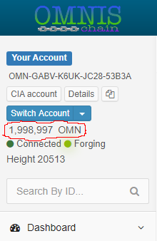
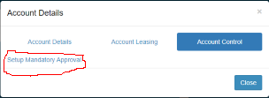
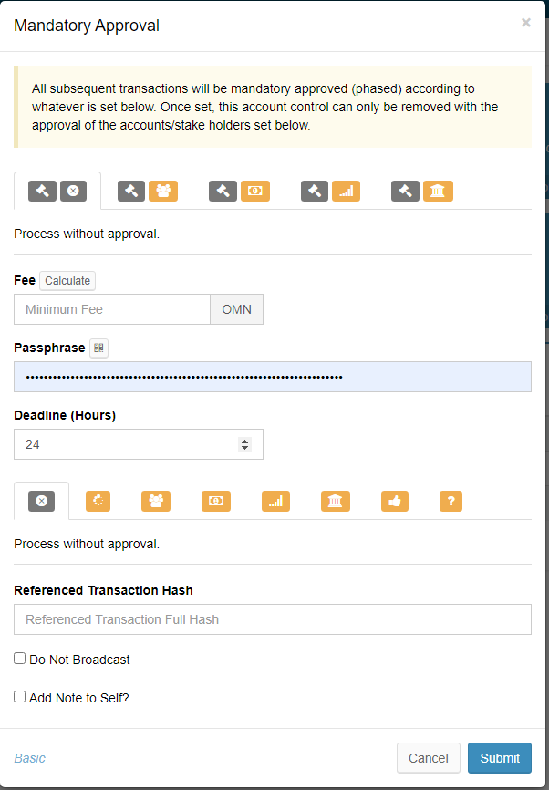

# Account Control

###  Description

Any account can be restricted to only be allowed to issue phased transactions subject to a specific voting model. This is achieved by the account submitting a setPhasingOnly transaction using the setPhasingOnlyControl API. The getPhasingOnlyControl API can be used to retrieve the status of an account phasing control, and getAllPhasingOnlyControls to get all accounts subject to phasing control with their respective restrictions. The account control feature relies on the [Phasing](https://nxtdocs.jelurida.com/Phasing) feature.

Phasing parameters which refer to transaction IDs must now use transaction full hashes instead, prefixed with the chain ID separated with ':'.

It is possible to refer to transactions on other chains when approving a phased transaction, or setting up a by-transaction phasing voting model. The controlMaxFees parameter when setting mandatory approval now accepts multiple values, each fee being prefixed with the child chain ID and ':', to indicate which child chain the limit applies to. If no max fee has been set for a child chain, there is no phasing transactions fees total limit on it for the controlled account. Currently the UI only supports setting max fee for the current chain.

These features present some interesting account usage scenarios:

* Multi-signature account [\[1\]](https://nxtdocs.jelurida.com/Account_control#cite_note-1)
* Tagging an account as a "savings" account, with no ability to send OMN
* Using a locked account as an "escrow" account
* limiting the ability to transfer assets, aliases or other entities from an account

### Setting Account Control

To set account control on your account, click on the "Account Balance" tile.

Then select the "Account Control" tab then click on the "Setup Mandatory Approval" link.

This will will load the "Mandatory Approval" dialog.

The rest of the parameters are explained using balloon text on the dialog. Use the same method to remove the account control from an account which is under account control, account control removal transaction is subject to the same account control restrictions.

### Using Account Control

When creating a transaction from an account which is under account control. Additional widget appears on the transaction dialog. It allows the user to select the specific phasing height and links to the account control information.

Note: Some exchanges do not accept phased transactions. In such cases, the approach would be to transfer first into a non-controlled account \("Hot Wallet"\), and from there transfer to the exchange.

1. [Jump up↑](https://nxtdocs.jelurida.com/Account_control#cite_ref-1) For a detailed step-by-step guide, you can have a look at [Use the Phasing Feature to Emulate Multisig Accounts in the NXT Platform](https://nxtdocs.jelurida.com/Use_the_Phasing_Feature_to_Emulate_Multisig_Accounts_in_the_NXT_Platform)

[Category](https://nxtdocs.jelurida.com/Special:Categories): 

* [Features](https://nxtdocs.jelurida.com/Category:Features)

